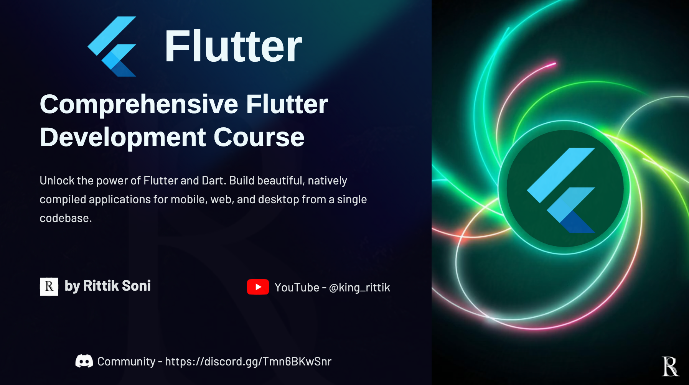

# Flutter Masterclass: Beginner to Advanced

  

[](resources/King%20Rittik%20Flutter%20Training%20Tutorial.pdf)

A comprehensive **Flutter** training repository accompanying the video series by **Rittik Soni**. This repo contains all source code examples and learning resources (PPT/PDF) used throughout the course, guiding you from **beginner** to **advanced** Flutter development.

---

## Table of Contents

1. [Course Overview](#course-overview)
2. [Prerequisites](#prerequisites)
3. [Learning Resources](#learning-resources)
4. [Getting Started](#getting-started)
5. [License](#license)
6. [Contact](#contact)

---

## Course Overview

This training covers:

- Flutter fundamentals & Dart language basics
- Widgets, layouts, navigation & routing
- State management (setState, Provider, Riverpod)
- Asynchronous programming & networking
- Data persistence (SharedPreferences, SQLite, Firestore)
- Advanced concepts: themes, animations, platform channels
- Building, testing & deploying cross-platform apps

---

## Prerequisites

- Flutter SDK ≥ 3.0.0
- Dart SDK ≥ 2.17.0
- IDE (VS Code, Android Studio) with Flutter & Dart plugins
- Basic knowledge of programming concepts

---

## Learning Resources

All presentation slides and PDFs used in the videos are available in the `resources/` folder:

- **PDF Slides**: `resources/*.pdf`
- **PowerPoint Presentations**: `resources/example_ppts/*.pptx`

[Download all resources as ZIP](resources/King%20Rittik%20Flutter%20Training%20Tutorial.pdf)

---

## Getting Started

1. **Clone the repo**
   ```bash
   git clone https://github.com/RittikSoni/Flutter-Training.git
   cd flutter-training
   ```
2. **Install dependencies**
   ```bash
   flutter pub get
   ```

---

## License

This project is licensed under the **MIT License**. See [LICENSE](LICENSE) for details.

---

## Contact

Created with ❤️ by **Rittik Soni**

- YouTube: [@king_rittik](https://www.youtube.com/@king_rittik?sub_confirmation=1)
- Discord: [Join the community](https://discord.gg/Tmn6BKwSnr)
- Email: contact.kingrittik@gmail.com

**Happy Coding! 🚀**
